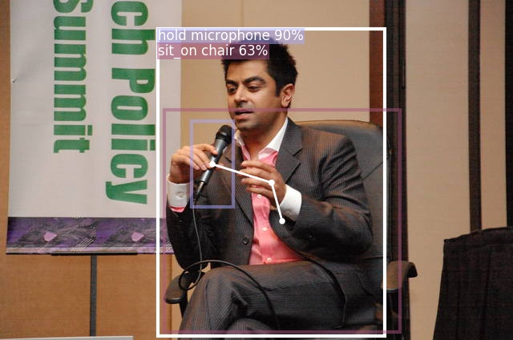

**The implementation of "Discovering Human Interactions with Novel Objects via Zero-Shot Learning", in CVPR, 2020.**
# ZSHOI
To update.



## Getting Started


### Prerequisites

- Linux or macOS with Python ≥ 3.6
- [PyTorch](https://pytorch.org) ≥ 1.4, torchvision that matches the PyTorch installation.
- [Detectron2](https://github.com/facebookresearch/detectron2)
- Other packages listed in [reuirements.txt](./requirements.txt)

### Installation

1. Please follow the [instructions](https://github.com/facebookresearch/detectron2/blob/master/INSTALL.md) to install detectron2 first.
2. Install other dependencies by `pip install -r requirements.txt` or `conda install --file requirements.txt`
3. Download and prepare the data by `sh prepare_data.sh`.
    - The [HICO-DET](http://www-personal.umich.edu/~ywchao/hico/) dataset and [V-COCO](https://github.com/s-gupta/v-coco) dataset.
      - If you already have, please comment out the corresponding lines in [prepare_data.sh](./prepare_data.sh) and **hard-code the dataset path using your custom path** in [lib/data/datasets/builtin.py](./lib/data/datasets/builtin.py).
    - COCO's format annotations for HICO-DET and VCOCO dataset.
    - [Glove](https://nlp.stanford.edu/projects/glove/) semantic embeddings.

### Demo Inference with Pre-trained Model

1. Download our pre-trained model on [HICO-DET dataset]() or V-COCO dataset. *Note: HICO-DET dataset allows 116 (excluding "no_interaction") actions, while V-COCO allows 25 actions*.

    ```
    cd demo
    # Download pre-trained model on HICO-DET dataset
    sh download_pretrained_hicodet.sh
    # Or download pre-trained model on V-COCO dataset
    sh download_pretrained_vcoco.sh
    ```

2. Run demo with pre-trained model (for example, pretrained model on HICO-DET)
    ```
    python demo.py --config-file ./configs/HICO-DET/interaction_R_50_FPN.yaml \
      --input ./demo/HICO_test2015_00003124.jpg \
      --opts MODEL.WEIGHTS ./output/hico_det_pretrained.pkl
    ```
- If to run demo for images in 'directory/*.jpg', replace `--input input1.jpg input2.jpg` with `--input directory/*.jpg`.
- If to run demo on a video, please replace `--input input1.jpg input2.jpg` with `--video-input video.mp4`.
- To save outputs to a directory (for images) or a file (for webcam or video), use `--output`, by default `../output/`

3. Run demo to discover human interactions with novel (zero-shot) objects. Please incidate the interested novel objects (categories out of 80 MS-COCO objects) via command line arguments.
    ```
    python demo.py --config-file ./configs/HICO-DET/interaction_zero_shot_R_50_FPN.yaml \
      --novel-object microphone paddle \
      --input ./demo/HICO_test2015_00003124.jpg \
      --opts MODEL.WEIGHTS ./output/hico_det_pretrained.pkl
    ```

## Training a model and running inference

### 1. Human-Object Region Proposals Network (HORPN) only
This example is provided for training the human-object region proposals network (note: not for the interacting object detection or HOI detection). HORPN is used as the first stage of our full model to generate region proposals of interacting objects. This example will train HORPN on `vcoco_train_known` set which includes only the images and annotations of known objects. **Please hard-code the path to images and annotation files in `lib/data/datasets/builtin.py` before runing the code.**

```
# To train HORPN
python train_net.py --num-gpus 2 \
  --config-file configs/horpn_only.yaml OUTPUT_DIR ./output/horpn_only
```

To run inference on `vcoco_val` which includes both known and novel objects.

```
# To run inference to evaluate HORPN. Using multiple GPUs can reduce the total inference time.
python train_net.py --eval-only --num-gpus 2 \
  --config-file configs/horpn_only.yaml \
  MODEL.WEIGHTS ./output/horpn_only/model_final.pth \
  OUTPUT_DIR ./output/horpn_only
```

**Expected results**
- Inference time should around 0.069s/image (on V100 GPU)
- The evaluation results of generated proposals will be listed, e.g, AR, Recall
    | Expected results | Recall(IoU=0.5)@100 | Recall(IoU=0.5)@500 |
    | :--- | :---: | :---: |
    | Known objects | 92.34 | 96.53 |
    | Novel objects | 81.64 | 92.42 |

### 2. Interacting Object Detection
The following examples train a model to detect interacting objects. In this case, we aim to detect objects which are interacting with humans. We train the model on `hico-det_train` set using all 80 MS-COCO object categories.

```
# Interacting object detection
python train_net.py --num-gpus 2 \
  --config-file configs/HICO-DET/interacting_objects_R_50_FPN.yaml OUTPUT_DIR ./output/interacting_objects
```

To run inference on `hico-det_test`. We use COCO's metrics and APIs to conduct evaluation. Note that the ground-truth only includes interacting objects (non-interacting objects will be seen as background).

```
# To run inference. Using multiple GPUs can reduce the total inference time.
python train_net.py --eval-only --num-gpus 2 \
  --config-file configs/HICO-DET/interacting_objects_R_50_FPN.yaml \
  MODEL.WEIGHTS ./output/HICO_interacting_objects/model_final.pth \
  OUTPUT_DIR ./output/HICO_interacting_objects
```

**Expected results**
- Inference time should around 0.074s/image (on V100 GPU)
- The results of COCO's metrics will be listed, e.g, per-class Average Precision (AP)
    | Expected results | AP | AP50 | AP75 |
    | :--- | :---: | :---: | :---: |
    | Interacting objects | 25.623 | 44.765 | 25.768 |


### 3. HOI Detection
The following examples train a model to detect human-object interactions using `hico-det_train` set. Here we use all 80 MS-COCO object categories.

```
# Interacting object detection
python train_net.py --num-gpus 2 \
  --config-file configs/HICO-DET/interaction_R_50_FPN.yaml OUTPUT_DIR ./output/HICO_interaction
```

To run inference on `hico-det_test`. This code will trigger the official HICO-DET MATLAB evaluation. Please make sure MATLAB is available in your machine and check the hard-coded path `cfg.TEST.HICO_OFFICIAL_ANNO_FILE` and `cfg.TEST.HICO_OFFICIAL_BBOX_FILE` can access direct to the original HICO-DET annotation files.

```
# To run inference. Using multiple GPUs can reduce the total inference time.
python train_net.py --eval-only --num-gpus 2 \
  --config-file configs/HICO-DET/interaction_R_50_FPN.yaml \
  MODEL.WEIGHTS ./output/interaction_R_50_FPN.yaml/model_final.pth \
  OUTPUT_DIR ./output/interaction_R_50_FPN.yaml
```

**Expected results**
- Inference time should around 0.0766s/image (on V100 GPU)
- It will list the results of COCO's metrics on interacting object detection as above.
- The results of HICO-DET's metrics will be listed, e.g,
    | Expected results |  full   |   rare   |  non-rare |
    | :--- | :---: | :---: | :---: |
    | Default mAP | 23.013 | 15.630 | 25.525 |

### 3. Zero-Shot HOI Detection
The following examples train a model to detect zero-shot human-object interactions using `hico-det_train` set. The only difference from the above is to use class agnostic bbox regressor.

```
# Interacting object detection
python train_net.py --num-gpus 2 \
  --config-file configs/HICO-DET/interaction_zero_shot_R_50_FPN.yaml OUTPUT_DIR ./output/HICO_interaction_zero_shot
```

To run inference, you can specify the interested novel object categories by `--novel-object object1 object2 object3`.

```
  python demo.py --config-file ./configs/HICO-DET/interaction_zero_shot_R_50_FPN.yaml \
    --novel-object microphone paddle \
    --input ./demo/HICO_test2015_00003124.jpg \
    --opts MODEL.WEIGHTS ./output/hico_det_pretrained.pkl
```

## Known/Novel Split - 80 MS-COCO Objects
To simulate the zero-shot cases, we split the 80 object categories into known and novel set based on their occurrence in HICO-DET and VCOCO datasets. The split can be found at [datasets/known_novel_split.py](./datasets/known_novel_split.py).

## Citing
If you use this code in your research or wish to refer to the baseline results published, please use the following BibTeX entry.
```
@InProceedings{Wang_2020_CVPR,
author = {Wang, Suchen and Yap, Kim-Hui and Yuan, Junsong and Tan, Yap-Peng},
title = {Discovering Human Interactions with Novel Objects via Zero-Shot Learning},
booktitle = {The IEEE Conference on Computer Vision and Pattern Recognition (CVPR)},
month = {June},
year = {2020}
}
```

## License

This project is licensed under the MIT License - see the [LICENSE.md](LICENSE.md) file for details
